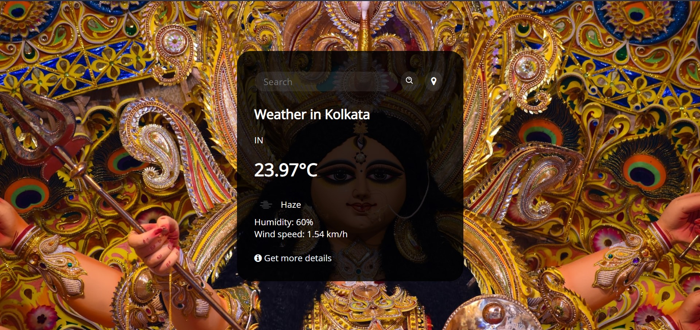
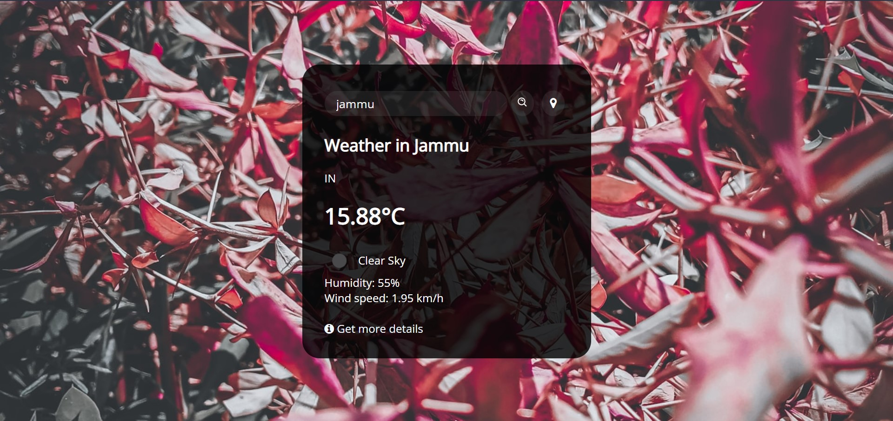
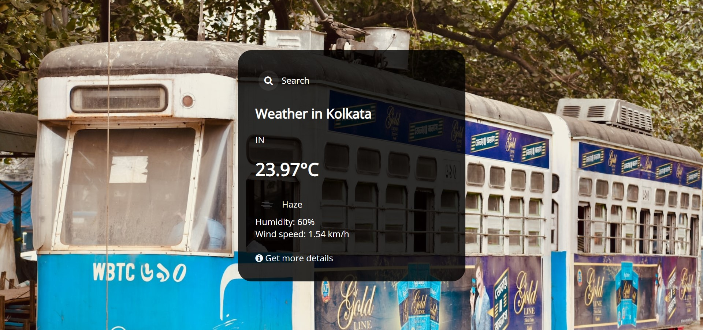
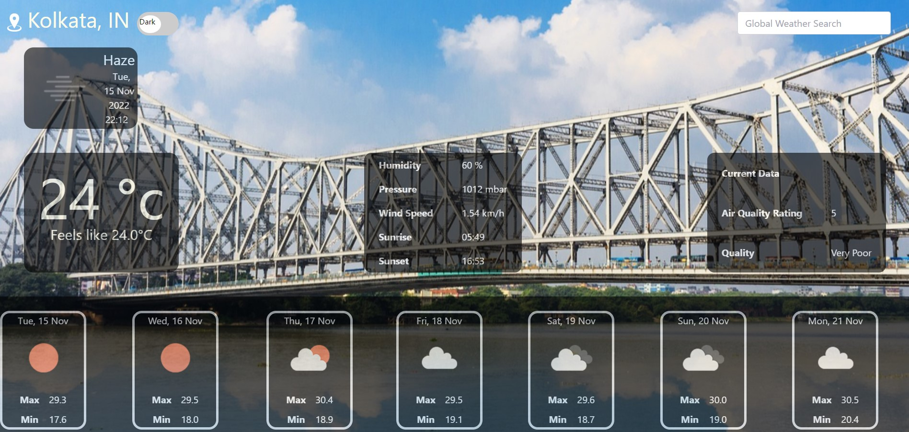
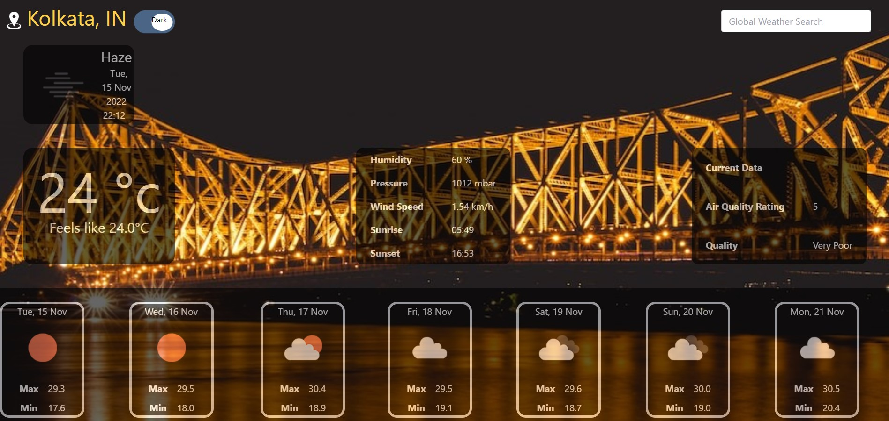
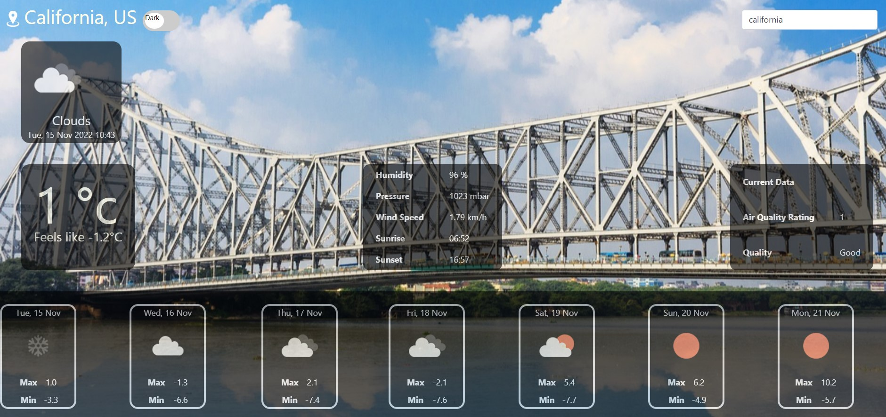

# Weather Forecast 

<b>Weather forecast</b> is the application of science and technology to predict the conditions of the atmosphere for a given location and time. People have attempted to predict the weather informally for millennia and formally since the 19th century. Weather forecasts are made by collecting quantitative data about the current state of the atmosphere, land, and ocean and using meteorology to project how the atmosphere will change at a given place.

### My Idea 💡
---
The main idea behind this project is to determine the weather conditions of any location that is searched. This is <b>v3.0.0</b> and is the latest version. I've added some new features in this project, which include features like "Getting weather details of your current location just by a mouse click" and also a feature called "Get more details", which will show the weather condition of the searched place for the next few days and also provide the current weather condition in much more detail.

I've used the <a href="https://openweathermap.org/" style="text-decoration: none"><b>OpenWeatherMap</b></a> API to get the weather details for this project.

Also, you will notice that the background image will change according to the place you search for;for that, I've used <a href="https://unsplash.com/"><b>Unsplash</b></a>.
 --------------------------------------------------------------------------------------------------------------------------------- 
<a href="http://weatherforecasthkp.epizy.com/">Click here for Demo ☁️🌡️</a>   The demo might not work properly as the hosted server doesn't allow it properly, so I'd recommend running it on your localhost.
 --------------------------------------------------------------------------------------------------------------------------------- 

### Few Screenshots 🎴
---

🔼This is the first view, or you can say the default view, when you first open the "Weather Forecast App," but the background image may differ as it shows a different image every time you open the app.
 

🔼Here I've searched 'Jammu' to know its weather condition
 

🔼After I clicked the location button, it fetched my location and showed the weather condition of my place. You will notice the background image has also changed.
 

🔼Now after I clicked the 'Get more details' button, it opened a different page and fetched my current location and showed the weather details of my place. And this page is currently in <i>Light view</i>
 

🔼This is <i>Dark view</i>.
 

🔼This page now has a placeholder where it will fetch weather information for any country in this globe. 
 

---

<a href="https://viruszzwarning.medium.com"><u>Check out my Blogs</u></a>  

<h4><u>Follow my socials:</u></h4>
<a href="https://twitter.com/hrisikesh_pal">Twitter</a>|| 
<a href="https://www.facebook.com/therealhrisikesh">Facebook_Page</a>|| 
<a href="https://www.linkedin.com/in/viruszzwarning/">LinkedIn</a> ||
<a href="https://www.youtube.com/@JustHack_IT">JustHack_IT</a>

<h4>Donations appreciated:</h4>
<a href="https://paypal.me/hrisikeshpal">PayPal</a>||
<a href="https://www.buymeacoffee.com/hrisikesh">BuyMeACoffee</a>  

<b><i>M@d3 With ❤ -- VirusZzWarning</i></b>

## Credits & License:

----
<b>Weather Forecast</b> were put together by [Hrisikesh](https://twitter.com/hrisikesh_pal) [(VirusZzWarning)](https://github.com/VirusZzHkP). <b>Weather Forecast</b> is licensed under the [GNU General Public License v3.0 ](LICENSE).
